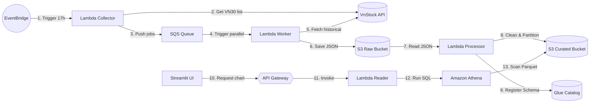

# TÀI LIỆU THUYẾT TRÌNH & ĐỊNH HƯỚNG KIẾN TRÚC TỐI ƯU
**Dự án: AWS Serverless Financial Data Lake (Đồ án FCAJ AWS Bootcamp)**

> [!IMPORTANT]
> **Góc nhìn từ Senior Solutions Architect:**
> Tài liệu này được thiết kế cấu trúc lại theo chuẩn báo cáo kỹ thuật doanh nghiệp (Technical Proposal). Mục tiêu là giúp nhóm 5 người thống nhất phương án triển khai nhanh nhất, tối ưu chi phí (FinOps), và tối đa điểm số từ Hội đồng đánh giá (đánh giá cao tư duy Cloud-Native và khả năng tự động hóa).

---

## PHẦN 1: BẢNG SO SÁNH PHƯƠNG ÁN KIẾN TRÚC

Dưới đây là so sánh trực quan giữa mô hình truyền thống (Container hóa kết hợp cơ sở dữ liệu quan hệ) và mô hình hiện đại (Serverless Event-Driven Data Lake).

| Tiêu chí so sánh | Phương án 1: Container & RDS PostgreSQL (Truyền thống) | Phương án 2: 100% Serverless & Athena (Đề xuất) |
| :--- | :--- | :--- |
| **Mô hình vận hành** | Chạy liên tục 24/7 (Always-on) | Kích hoạt theo sự kiện (On-demand/Event-driven) |
| **Lưu trữ chính** | RDS PostgreSQL (Lưu bảng quan hệ) | S3 (Raw/Curated) lưu Parquet nén cột |
| **Giao tiếp API** | FastAPI chạy trên ECS Fargate / App Runner | API Gateway + AWS Lambda Reader |
| **Tự động hóa Ingestion**| APScheduler chạy ngầm trong container | EventBridge Scheduler + SQS Queue |
| **Độ phức tạp hạ tầng** | **Rất cao** (Cần thiết lập VPC, Subnets, NAT Gateway, Security Groups, ALB) | **Thấp đến Trung bình** (Cấu hình IAM Roles, SQS, S3, không cần NAT Gateway) |
| **Khả năng chịu tải** | Bị giới hạn bởi cấu hình CPU/RAM của server | Tự động co giãn (Auto-scale) theo lượng message |
| **Chi phí cố định/Tháng** | **Tối thiểu $25 - $40** (Dù không có ai truy cập web) | **Gần như $0** (Nằm hoàn toàn trong AWS Free Tier) |

---

## PHẦN 2: THUYẾT TRÌNH CHI TIẾT VAI TRÒ CỦA TỪNG DỊCH VỤ SERVERLESS

Để giải thích thuyết phục cho cả nhóm và Hội đồng, chúng ta cần làm rõ: **Mỗi thành phần giải quyết bài toán gì và tại sao nó tối ưu?**



### 1. Amazon EventBridge (Scheduler)
- **Nhiệm vụ:** Tự động kích hoạt luồng chạy lúc 17:00 hàng ngày.
- **Tại sao cần:** Thay vì chạy một server ngồi chờ 24h chỉ để chạy code 5 phút, EventBridge là giải pháp zero-maintenance (không cần bảo trì) và hoàn toàn miễn phí.

### 2. AWS Lambda Collector
- **Nhiệm vụ:** Gọi API Vnstock lấy danh sách 30 mã VN30 và đẩy vào SQS.
- **Tại sao cần:** Hàm này chạy dưới 2 giây, không tốn tài nguyên. Nhiệm vụ duy nhất là phân rã công việc (decouple) để các bước sau chạy song song.

### 3. Amazon SQS (Message Queue)
- **Nhiệm vụ:** Làm bộ đệm lưu trữ 30 tác vụ cào dữ liệu cho 30 mã chứng khoán.
- **Tại sao cần:** **Chống nghẽn IP (Rate Limit)**. Nếu chạy cào 30 mã cùng lúc, Vnstock sẽ block IP của chúng ta. SQS giúp phân phối tác vụ từ từ, có cơ chế tự động chạy lại (Retry) và đưa các tác vụ lỗi vào Dead Letter Queue (DLQ) để điều tra sau.

### 4. AWS Lambda Worker (Docker Containerized)
- **Nhiệm vụ:** Nhận message từ SQS, cào dữ liệu lịch sử giá của mã đó và ghi file JSON lên S3.
- **Tại sao cần:** Đóng gói code cào dữ liệu bằng Docker giúp giải quyết triệt để giới hạn dung lượng 250MB của Lambda khi cài các thư viện nặng (`pandas`, `vnstock`).

### 5. Amazon S3 (Data Lake Storage)
- **Nhiệm vụ:** Lưu trữ dữ liệu thô (Raw JSON) và dữ liệu đã làm sạch (Curated Parquet).
- **Tại sao cần:** Chi phí lưu trữ S3 cực kỳ rẻ ($0.023/GB) và có độ bền dữ liệu đạt 99.999999999% (11 số 9), tối ưu hơn nhiều so với việc lưu trữ file trên ổ cứng máy chủ EC2.

### 6. AWS Glue Data Catalog & Amazon Athena
- **Nhiệm vụ:** Glue Catalog định nghĩa cấu trúc dữ liệu trên S3; Athena chạy các câu lệnh SQL để truy vấn trực tiếp file Parquet trên S3.
- **Tại sao cần:** Đây là mô hình **Modern Data Lakehouse**. Chúng ta không cần cài đặt bất kỳ hệ quản trị cơ sở dữ liệu (Database) nào. Athena là Serverless SQL, chỉ tính tiền trên dung lượng dữ liệu quét qua, giúp tối ưu hóa chi phí truy vấn.

### 7. Amazon API Gateway & Lambda Reader
- **Nhiệm vụ:** API Gateway tiếp nhận HTTP Request từ Streamlit Web, Lambda Reader gọi Athena lấy dữ liệu và trả về JSON.
- **Tại sao cần:** Cửa ngõ bảo mật Serverless. Tự động scale từ 0 lên hàng ngàn request đồng thời mà nhóm không cần phải cấu hình cân bằng tải (Load Balancer).

---

## PHẦN 3: PHÂN TÍCH CHI PHÍ THỰC TẾ (AWS FINOPS)

> [!TIP]
> **Nhận xét từ Senior:**
> Đây là bảng phân tích chi phí chi tiết dựa trên công thức tính giá thực tế của AWS. Con số này sẽ giúp team tự tin phản biện trước hội đồng rằng dự án cực kỳ kinh tế.

### 1. Phân tích chi tiết từng dịch vụ (Ước tính chạy 30 ngày/Tháng)

#### A. AWS Lambda (Collector, Worker, Reader, Processor)
- **Công thức:** `Số request x Đơn giá` + `Thời gian chạy (GB-seconds) x Đơn giá`.
- **Tính toán:** 
  - Tổng số request: 30 mã x 30 ngày = 900 request/tháng (Worker) + 30 request/tháng (Collector) + ~1,000 request truy cập web = ~2,000 requests.
  - Bộ nhớ cấu hình: 512MB RAM. Thời gian chạy trung bình: 5s/request.
  - Tổng GB-seconds: `2,000 x 5s x (512MB / 1024MB)` = 5,000 GB-seconds.
- **AWS Free Tier:** Miễn phí 1 triệu request và 400.000 GB-seconds mỗi tháng.
- **Thực tế thanh toán:** **$0.00**

#### B. Amazon SQS
- **AWS Free Tier:** Miễn phí 1 triệu request/tháng.
- **Tính toán:** Nhóm chỉ sử dụng khoảng 3,000 request/tháng.
- **Thực tế thanh toán:** **$0.00**

#### C. Amazon S3
- **AWS Free Tier:** 5 GB dung lượng Standard lưu trữ miễn phí trong 12 tháng đầu.
- **Dữ liệu thực tế:** 30 mã VN30 x 100KB/file JSON x 30 ngày = ~90MB dữ liệu thô. Chuyển sang Parquet nén cột còn ~15MB.
- **Thực tế thanh toán:** **$0.00** (Nếu hết Free Tier: `0.1GB x $0.023/GB` = **$0.0023/tháng**).

#### D. Amazon Athena
- **Công thức:** $5.00 cho mỗi 1 Terabyte (TB) dữ liệu được quét.
- **Tính toán:** Mỗi lần người dùng click xem biểu đồ trên Streamlit, Athena quét file Parquet tương ứng (~100KB). Nếu có 1,000 lượt xem/tháng:
  - Dung lượng quét: `1,000 x 100KB` = 100MB = 0.0001 TB.
  - Chi phí: `0.0001 TB x $5.00` = $0.0005.
- **Thực tế thanh toán:** **$0.00** (AWS miễn phí các khoản phí dưới $0.01).

#### E. Amazon ECR (Lưu trữ Docker Image)
- **Công thức:** $0.09 cho mỗi GB lưu trữ/tháng.
- **Tính toán:** 3 Docker images cho Lambda (Collector, Worker, Reader) x 300MB/image = 900MB = ~0.9 GB.
- **Thực tế thanh toán:** **$0.08 / tháng** (Khoảng 2,000 VNĐ).

#### F. AWS App Runner / ECS Fargate (Deploy Streamlit Dashboard)
- **Công thức:** Tính theo CPU và RAM sử dụng theo giây.
- **Cấu hình tối thiểu (0.25 vCPU, 0.5 GB RAM):** Khoảng $0.007/giờ cho CPU + $0.001/giờ cho RAM = ~$6.00/tháng.
- **Giải pháp tiết kiệm:** Để demo đồ án, Streamlit có thể chạy trực tiếp trên máy local (gọi API Gateway lên AWS) hoặc deploy miễn phí lên **Streamlit Community Cloud** kết nối về API Gateway của nhóm.
- **Thực tế thanh toán:** **$0.00** (Nếu dùng Streamlit Cloud) hoặc **$6.00** (Nếu deploy lên AWS).

---

## PHẦN 4: THIẾT KẾ ĐỂ ĐƯỜNG ỐNG KHÔNG PHỤ THUỘC VNSTOCK (DATA AGNOSTIC)

Để hệ thống hoạt động trơn tru kể cả khi đổi sang cào dữ liệu Thời tiết, Crypto hay Giá vàng, kiến trúc Serverless của Phong sử dụng thiết kế **Schema-Agnostic** (Không phụ thuộc cấu trúc):

1.  **SQS Message cấu hình động:** Tin nhắn SQS không chứa dữ liệu chứng khoán mà chứa chỉ thị công việc:
    ```json
    {
      "source_type": "crypto",
      "target_id": "BTC-USDT",
      "api_endpoint": "https://api.binance.com/api/v3/klines"
    }
    ```
2.  **Sử dụng AWS Glue Crawlers:** Khi dữ liệu thay đổi từ chứng khoán (Open, Close, High, Low) sang thời tiết (Temperature, Humidity, Wind), chúng ta không cần sửa cấu hình bảng. Glue Crawler sẽ tự động quét file Parquet mới trên S3, phân tích header và cập nhật schema mới vào Data Catalog cho Athena.
3.  **Athena Dynamic Query:** Lambda Reader sẽ nhận query params từ Streamlit (ví dụ: `/query?table=crypto&id=BTC`) để sinh ra câu query SQL động, giúp Backend hoàn toàn độc lập với cấu trúc bảng.

---

## PHẦN 5: PHÂN CHIA NHIỆM VỤ CHI TIẾT CHO TEAM 5 NGƯỜI (ROADMAP 3 TUẦN)

Với team 5 người, chúng ta chia nhóm thành các vai trò chuyên biệt để chạy song song:

```
                      ┌─────────────────────────────┐
                      │    TEAM 5 NGƯỜI PHÂN TASK   │
                      └──────────────┬──────────────┘
      ┌──────────────┬───────────────┼───────────────┬──────────────┐
      ▼              ▼               ▼               ▼              ▼
  [Dev 1]        [Dev 2]         [Dev 3]         [Dev 4]        [Dev 5]
  DevOps/IaC     Ingestion       ETL/Glue        Backend/API    Frontend UI
```

### 1. Chi tiết phân công công việc
*   **Dev 1 (DevOps/IaC):** Viết mã Terraform khởi tạo tài nguyên AWS (S3, SQS, ECR, IAM, API Gateway). Cấu hình bảo mật và S3 Backend để cả nhóm làm việc chung.
*   **Dev 2 (Ingestion Specialist):** Viết code Python cho `Lambda Collector` và `Lambda Worker` gọi API cào dữ liệu. Viết `Dockerfile` và đẩy ảnh lên ECR.
*   **Dev 3 (Data Pipeline Engineer):** Viết code Python/awswrangler cho `Lambda Processor` thực hiện ETL (chuyển JSON sang Parquet, phân vùng dữ liệu theo Ngày/Tháng/Năm). Thiết lập Glue Data Catalog.
*   **Dev 4 (Backend API Engineer):** Viết code cho `Lambda Reader` thực hiện kết nối SDK Athena (`boto3`) để thực thi câu lệnh SQL và trả kết quả JSON sạch về API Gateway.
*   **Dev 5 (Frontend UI & Slide):** Dựng Dashboard Streamlit kết nối API Gateway để hiển thị đồ thị nến, bộ lọc ngày tháng. Vẽ sơ đồ Draw.io chuẩn chỉnh và làm Slide báo cáo.

### 2. Kế hoạch chạy 3 tuần cụ thể

| Tuần | Dev 1 (IaC) | Dev 2 (Ingestion) | Dev 3 (ETL) | Dev 4 (Backend) | Dev 5 (Frontend) |
| :--- | :--- | :--- | :--- | :--- | :--- |
| **Tuần 1** | Setup IAM User, lưu Access Key. Tạo S3 backend lưu tfstate của nhóm. | Viết code cào VnStock thô chạy local bằng Python. | Tìm hiểu cấu trúc dữ liệu đầu ra và định dạng Parquet. | Thiết kế cấu trúc các API endpoint (API Spec). | Dựng khung Streamlit, vẽ chart bằng dữ liệu tĩnh (mock CSV). |
| **Tuần 2** | Viết Terraform tạo S3, SQS, IAM Roles. Triển khai lên AWS. | Viết Dockerfile cho Collector/Worker. Push ECR. Đưa code lên AWS Lambda. | Viết code Lambda Processor (awswrangler). Chạy thử ghi Parquet lên S3. | Viết code Lambda Reader gọi Athena query. Dùng Terraform tạo API Gateway. | Tích hợp Streamlit gọi thử API mock để hiển thị dữ liệu thô. |
| **Tuần 3** | Rà soát lỗi bảo mật, hỗ trợ team deploy API Gateway HTTPS. | Test hệ thống tự động: EventBridge chạy tự động ghi file JSON lên S3. | Cấu hình Glue Crawler quét file Parquet tự động cập nhật database. | Kết nối luồng hoàn chỉnh: API Gateway -> Lambda Reader -> Athena -> S3 Curated. | Kết nối Streamlit vào API Gateway thực tế trên AWS. Viết slide, làm báo cáo. |

---

## PHẦN 6: CẤU TRÚC THƯ MỤC DỰ ÁN MẪU CHUẨN

```text
aws-serverless-data-lake/
├── terraform/                  # Thư mục quản lý Hạ tầng (IaC)
│   ├── provider.tf             # Khai báo AWS provider & S3 backend
│   ├── main.tf                 # Tạo S3, SQS, API Gateway, Athena
│   ├── lambda.tf               # Khai báo các Lambda Functions & ECR images
│   ├── iam.tf                  # Phân quyền IAM Roles & Policies
│   ├── variables.tf            # Các biến cấu hình hệ thống
│   └── outputs.tf              # Xuất ra link API Gateway sau khi tạo xong
│
├── src/                        # Thư mục chứa mã nguồn Backend (Logic)
│   ├── lambda_collector/       # Lambda Collector
│   │   ├── main.py             # Code Python thu thập mã VN30
│   │   ├── requirements.txt    # Thư viện sử dụng
│   │   └── Dockerfile          # Đóng gói collector
│   │
│   ├── lambda_worker/          # Lambda Worker
│   │   ├── main.py             # Code Python cào lịch sử giá
│   │   ├── requirements.txt    
│   │   └── Dockerfile          
│   │
│   ├── lambda_processor/       # Lambda ETL (Thay cho Glue để tối ưu)
│   │   ├── main.py             # Code Python dùng awswrangler convert sang Parquet
│   │   ├── requirements.txt    
│   │   └── Dockerfile          
│   │
│   └── lambda_reader/          # Lambda Reader (Backend API)
│       ├── main.py             # Code Python gọi Athena query
│       ├── requirements.txt    
│       └── Dockerfile          
│
├── frontend/                   # Thư mục mã nguồn Giao diện người dùng
│   ├── app.py                  # Giao diện Streamlit Dashboard gọi API Gateway
│   ├── requirements.txt        
│   └── Dockerfile              # Đóng gói để deploy Streamlit (nếu cần)
│
└── README.md                   # Hướng dẫn chạy dự án
```

---

## PHẦN 7: TẠI SAO KHÔNG DÙNG VPC, SUBNETS (PUBLIC/PRIVATE) VÀ EC2?

> [!WARNING]
> **Câu hỏi phản biện kinh điển của Hội đồng chấm thi:**
> *"Tại sao hệ thống của em không thấy cấu hình mạng VPC, Private/Public Subnet hay EC2 để bảo mật dữ liệu? Như vậy có phải là thiếu sót hay không?"*
> 
> Dưới đây là câu trả lời mang tư duy của một Senior Cloud Architect để bạn bảo vệ kiến trúc của mình một cách xuất sắc.

### 1. Bản chất mạng của các dịch vụ AWS Serverless
Các dịch vụ Serverless như **S3, SQS, API Gateway, Athena và Lambda (mặc định)** nằm trong phân vùng mạng dùng chung của AWS (AWS Public Zone), được bảo vệ bằng cơ chế xác thực **AWS IAM (Identity and Access Management)** cực kỳ nghiêm ngặt:
- Không có bất kỳ ai có thể truy cập vào S3 hay SQS từ bên ngoài Internet nếu không có IAM credentials (Access Key/Secret Key hoặc IAM Role) hợp lệ.
- Bảo mật bằng IAM là bảo mật ở mức ứng dụng (Application Level), an toàn và hiện đại hơn việc chỉ chặn IP ở mức mạng (Network Level).

### 2. Hệ quả tai hại nếu cố tình đưa Lambda vào Custom VPC
Nếu chúng ta tạo một VPC riêng rồi đưa các hàm Lambda vào **Private Subnet** (theo tư duy bảo mật truyền thống):
1. **Lambda sẽ mất hoàn toàn kết nối Internet:** Nó không thể gọi API Vnstock ở ngoài Internet để cào dữ liệu được nữa.
2. **Chi phí phát sinh rất lớn:** Để cấp lại Internet cho Lambda trong Private Subnet, ta bắt buộc phải mua dịch vụ **AWS NAT Gateway** đặt ở Public Subnet để chuyển tiếp gói tin.
   - NAT Gateway có phí thuê cố định là **~$32/tháng** (hơn 800,000 VNĐ) dù hệ thống có chạy dữ liệu hay không.
   - Đây là một sự lãng phí vô lý đối với một dự án Data Lake quy mô nhỏ/đồ án sinh viên.
3. **Độ trễ khởi động (Cold Start Delay):** Lambda trong VPC sẽ mất thêm vài giây để gắn card mạng ảo (ENI) mỗi khi được đánh thức, làm chậm tốc độ phản hồi của API.

### 3. Phân biệt dự án nào nên dùng và không nên dùng VPC/EC2

#### A. Dự án KHÔNG NÊN DÙNG VPC & EC2 (Ví dụ dự án Data Lake này)
- **Đặc điểm:** Chỉ đi cào dữ liệu công khai trên Internet (Stock, Coin, Weather), xử lý định kỳ rồi lưu trữ. Người dùng chỉ đọc dữ liệu hiển thị biểu đồ.
- **Lý do:** Không có thông tin người dùng nhạy cảm, không có cơ sở dữ liệu quan hệ nội bộ cần giấu. Bảo mật IAM cho S3/SQS và giao thức HTTPS của API Gateway là quá đủ. Tiết kiệm 100% chi phí NAT Gateway.

#### B. Dự án BẮT BUỘC PHẢI DÙNG VPC & EC2/RDS
- **Đặc điểm:** Các hệ thống Ngân hàng, Thương mại điện tử, Fintech chứa thông tin giao dịch tài chính, số dư ví, tài khoản mật khẩu của khách hàng.
- **Lý do:** Các dữ liệu này bắt buộc phải lưu trong các database chạy 24/7 (như RDS PostgreSQL, RDS MySQL) nằm sâu trong **Private Subnet** để không ai từ Internet có thể dò quét IP hoặc tấn công trực tiếp. Lúc này, Backend (EC2 hoặc Lambda trong VPC) sẽ giao tiếp nội bộ với Database qua mạng riêng tư, và phải trả tiền cho NAT Gateway để đi ra ngoài nếu cần kết nối API bên thứ ba (như cổng thanh toán).

---
*(Tài liệu lưu hành nội bộ - Đồ án tốt nghiệp chương trình FCAJ)*

