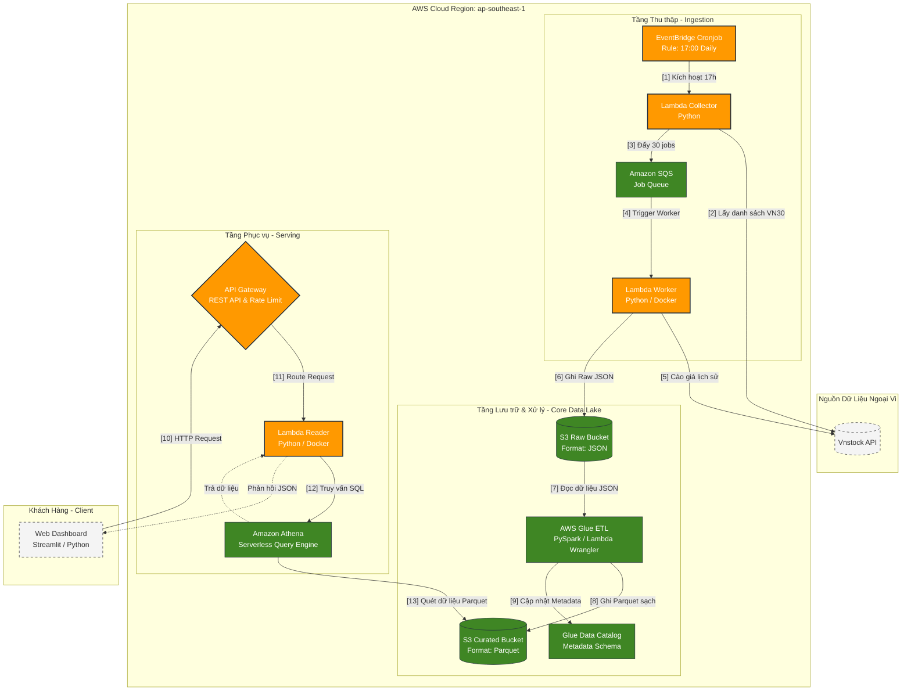

# Tổng Hợp: Báo Cáo Kỹ Thuật & Hướng Dẫn Triển Khai Thực Tế
**Dự án: AWS Serverless Financial Data Lake (Dành cho Team Sinh viên / Beginner)**

Tài liệu này bao gồm 2 phần chính: **Phần 1** dùng để copy vào báo cáo đồ án, giải thích kiến trúc và tích hợp sơ đồ luồng dữ liệu (bằng mã Mermaid trực quan). **Phần 2** là cẩm nang hướng dẫn triển khai thực tế bằng Terraform và Docker từng tuần để nhóm của bạn thực hành chuẩn xác.

---

# PHẦN 1: BÁO CÁO KIẾN TRÚC & LUỒNG DỮ LIỆU

## 1. Sơ đồ Kiến trúc & Luồng dữ liệu (Mermaid Diagram)
Dưới đây là sơ đồ luồng dữ liệu của hệ thống được thiết kế chuẩn chỉnh theo mô hình chia tầng (Tiers) tương tự bản vẽ của nhóm bạn trên Draw.io. Sơ đồ này hiển thị trực quan các phân vùng và hướng di chuyển của dữ liệu:



*Lưu ý: Bạn có thể copy đoạn mã Mermaid trên dán vào bất kỳ trình đọc Markdown nào (hoặc GitHub) để hiển thị trực tiếp thành sơ đồ dạng khối cực kỳ đẹp mắt.*

---

## 2. Mô tả Luồng Hoạt động Chi tiết (Data Flow Script)
Khi trình bày với team và giảng viên, hãy giải thích luồng đi của dữ liệu qua 3 giai đoạn chính dựa vào sơ đồ trên:

1.  **Giai đoạn 1: Thu thập (Ingestion):** 
    - `EventBridge` kích hoạt `Lambda Collector` lúc 17:00 chiều mỗi ngày.
    - Collector gọi tới `Vnstock API` lấy danh sách 30 mã VN30 rồi ném vào hàng đợi `SQS Queue`.
    - Hàng đợi kích hoạt song song `Lambda Worker` (đóng gói bằng Docker) để cào dữ liệu lịch sử của từng mã từ `Vnstock` và lưu vào `S3 Raw Bucket` dưới dạng file JSON thô.
2.  **Giai đoạn 2: Xử lý & Chuẩn hóa (ETL):** 
    - `AWS Glue` (hoặc Lambda thứ 3 chuyên làm ETL) tự động đọc file JSON thô trong `S3 Raw`.
    - Làm sạch các trường dữ liệu lỗi, loại bỏ trùng lặp, tính toán thêm chỉ số tài chính (như MA20, MA50) rồi ghi đè lên `S3 Curated Bucket` với định dạng lưu trữ cột **Parquet**.
    - Đồng thời đăng ký cấu hình bảng dữ liệu vào `Glue Data Catalog`.
3.  **Giai đoạn 3: Phục vụ Người dùng (Serving):** 
    - Người dùng truy cập trang `Streamlit Web`, chọn xem mã chứng khoán (ví dụ: FPT).
    - Request được gửi qua `API Gateway` để bảo mật và chống DDoS, sau đó truyền vào `Lambda Reader`.
    - Lambda Reader kích hoạt lệnh SQL gửi đến `Amazon Athena`. Athena quét trực tiếp trên kho dữ liệu Parquet tại `S3 Curated`, trích xuất kết quả cần tìm chuyển ngược lại cho Web hiển thị thành biểu đồ nến.

---

## 3. Luồng Hoạt Động của Terraform đến Các Dịch Vụ AWS
Để triển khai tự động toàn bộ hạ tầng này, **Terraform** hoạt động như một nhạc trưởng điều phối các dịch vụ AWS theo luồng tuần tự như sau:

```
[Mã nguồn .tf local] ──(terraform apply)──> [S3 Backend (tfstate)]
                                                   │
   ┌───────────────────────────────────────────────┴──────────────────────────────┐
   ▼ (Tạo bảo mật & Phân quyền trước)                                            ▼ (Khởi tạo kho chứa Container)
[AWS IAM Roles & Policies]                                                [Amazon ECR Repositories]
   │ (Cấp quyền đọc/ghi phù hợp)                                                  │
   ▼                                                                              ▼ (Đẩy Docker image lên)
[Amazon S3 Buckets] & [Amazon SQS Queue]                                  [Docker Images Pushed to ECR]
   │                                                                              │
   ├───────────────────────────────────────────────┬──────────────────────────────┘
   ▼ (Tạo các Compute Lambdas dựa trên Docker ECR Image & IAM)
[AWS Lambda Functions (Collector, Worker, Reader, Processor)]
   │
   ▼ (Thiết lập liên kết luồng kích hoạt tự động)
[EventBridge Rules (Trigger Collector)] ──> [SQS Trigger (Trigger Worker)] ──> [API Gateway Routes (Trigger Reader)]
```

### Chi tiết cách Terraform thiết lập từng dịch vụ:
1.  **Lưu trữ Trạng thái (State Lock):** Terraform sử dụng một **S3 Bucket phụ** làm Backend. Khi bất kỳ ai trong 3 thành viên gõ `terraform apply`, Terraform sẽ khóa file trạng thái lại để tránh việc 2 người cùng chỉnh sửa hạ tầng một lúc dẫn đến xung đột.
2.  **Thiết lập Bảo mật (IAM Role & Policy):** Terraform khởi tạo các Role bảo mật riêng biệt tuân thủ nguyên tắc quyền tối thiểu. Ví dụ: `Lambda Worker Role` chỉ được cấp quyền ghi vào S3 Raw chứ không được phép truy cập vào S3 Curated, nâng cao tính an toàn cho hệ thống.
3.  **Liên kết Container (ECR sang Lambda):** Terraform kết nối tới **Amazon ECR** để kiểm tra URI của Docker Image. Sau đó, nó ra lệnh cho AWS Lambda tải container này về làm môi trường chạy ứng dụng.
4.  **Tạo Hàng đợi & Trực quan luồng (SQS Event Source Mapping):** Terraform đăng ký dịch vụ SQS làm nguồn kích hoạt cho Lambda Worker. Mỗi khi có tin nhắn mới vào SQS, Lambda Worker chạy bằng Docker sẽ tự động nạp tin nhắn đó lên để xử lý.
5.  **Mở cổng API (API Gateway & Routes):** Terraform khởi tạo HTTP API Gateway, định nghĩa các Endpoint (ví dụ: `/stock-data`) và ánh xạ trực tiếp endpoint này vào Lambda Reader để sẵn sàng nhận request từ Web Streamlit.

---

# PHẦN 2: HƯỚNG DẪN TRIỂN KHAI THỰC TẾ (ROADMAP 4 TUẦN)

## 1. Cách triển khai Docker cho AWS Lambda
Do thư viện Data (`pandas`, `vnstock`, `pyarrow`) có dung lượng lớn hơn 250MB, ta bắt buộc phải sử dụng Docker để đóng gói.

**Các bước triển khai cụ thể:**
1.  **Cài đặt Docker Desktop** trên máy cá nhân của các thành viên.
2.  **Tạo file `Dockerfile`** mẫu cho Lambda Worker trong thư mục dự án:
    ```dockerfile
    FROM public.ecr.aws/lambda/python:3.9

    # Sao chép file requirements.txt vào container
    COPY requirements.txt ./

    # Cài đặt các thư viện cần thiết
    RUN pip install --no-cache-dir -r requirements.txt

    # Sao chép code chạy chính vào container
    COPY main.py ./

    # Khai báo hàm handler để AWS Lambda kích hoạt khi chạy
    CMD ["main.handler"]
    ```
3.  **Tạo Repository ECR trên AWS Console:** Tìm dịch vụ **ECR (Elastic Container Registry)** -> Chọn *Create repository* -> Đặt tên (ví dụ: `vnstock-worker`).
4.  **Build và Push Image lên ECR:**
    Vào ECR Repository vừa tạo -> Bấm nút **View push commands** ở góc phải màn hình. AWS sẽ hiện ra 4 câu lệnh chính xác để bạn Copy/Paste chạy trên Terminal máy tính nhằm đẩy Docker Image lên AWS Cloud.
5.  **Khai báo trong Terraform:**
    ```hcl
    resource "aws_lambda_function" "worker" {
      function_name = "vnstock-worker"
      role          = aws_iam_role.lambda_role.arn
      package_type  = "Image"
      image_uri     = "${aws_ecr_repository.worker.repository_url}:latest"
    }
    ```

---

## 2. Chuẩn bị AWS Console (Chống mất tiền oan)
Để đảm bảo an toàn tuyệt đối cho tài khoản thẻ của các bạn sinh viên:
1.  Đăng nhập AWS bằng tài khoản gốc (Root User).
2.  Tìm dịch vụ **IAM**, tạo 1 User mới tên là `admin-team3`.
3.  Tại phần gán quyền, chọn *Attach policies directly* -> Chọn **AdministratorAccess** (Quyền quản trị viên để Terraform chạy được).
4.  Vào tab **Security credentials** của User mới tạo -> Tạo **Access Key** (cho giao diện CLI). Tải file CSV chứa key về máy. **Tuyệt đối không đẩy file này lên Github.**
5.  Thoát tài khoản Root. Từ nay chỉ sử dụng User `admin-team3`.
6.  Trên Terminal máy cá nhân, gõ lệnh:
    ```bash
    aws configure
    ```
    Nhập Access Key và Secret Key của User `admin-team3` vào.

---

## 3. Kế hoạch Hành động 4 Tuần (Cầm tay chỉ việc)

### TUẦN 1: Chuẩn bị Môi trường & Viết Code Python + Docker (Chạy Local)
- **Nhiệm vụ chung:** Cài AWS CLI, Docker Desktop, Terraform. Lên AWS tạo 1 S3 Bucket tên `terraform-state-team3` để lưu trạng thái Terraform.
- **Thao tác Code (Dùng Prompt AI):**
  - Nhờ AI: *"Viết code Python hàm Lambda Collector: gọi API vnstock lấy 30 mã VN30, dùng boto3 gửi vào SQS. Viết thêm Dockerfile cho nó."*
  - Nhờ AI: *"Viết code Python hàm Lambda Worker: nhận message từ SQS, gọi Vnstock cào dữ liệu, lưu thành JSON ném lên S3 Raw."*
- **Chốt tuần 1:** Chạy thử `docker build` trên máy thành công.

### TUẦN 2: Dựng Hạ Tầng bằng Terraform & Nối luồng (Ingestion)
- **Đẩy Docker:** Dùng lệnh đẩy 2 cái Image lên Amazon ECR.
- **Viết Terraform (Nhờ AI):**
  - Nhờ AI: *"Viết code Terraform (main.tf) tạo 1 SQS Queue, 1 S3 Bucket, 2 hàm Lambda chạy bằng Docker Image từ ECR. Cấp IAM Role cho phép Lambda gọi SQS và S3."*
- **Triển khai:** Mở Terminal gõ `terraform init`, rồi `terraform apply`.
- **Chốt tuần 2:** Lên giao diện S3, thấy có 30 file JSON tự sinh ra là thành công 50% đồ án!

### TUẦN 3: Xử lý dữ liệu (ETL) & Thiết lập Athena
- **Viết Code Lambda Processor (Thay cho Glue PySpark để dễ làm hơn):**
  - Nhờ AI: *"Viết hàm Lambda Python dùng thư viện awswrangler. Nó tự kích hoạt khi có file JSON trên S3 Raw, lọc null, chuyển thành Parquet và lưu sang S3 Curated."*
- **Triển khai:** Build Docker image thứ 3, đẩy lên ECR, dùng Terraform tạo hàm Lambda này.
- **Setup Athena:** Nhờ AI viết câu lệnh `CREATE EXTERNAL TABLE ... STORED AS PARQUET` để trỏ vào S3 Curated. Truy vấn thử `SELECT` ra data.

### TUẦN 4: Phân phối API & Làm Web Dashboard UI
- **Backend API:**
  - Nhờ AI: *"Viết Lambda Reader nhận Ticker từ API Gateway, dùng boto3 chạy truy vấn Athena SELECT, trả về JSON. Viết thêm Terraform cho API Gateway."* Chạy `terraform apply` để lấy link API.
- **Frontend Streamlit:**
  - Nhờ AI: *"Viết trang web Streamlit gọi đến URL API của tôi, vẽ biểu đồ nến (Candlestick) và bộ lọc thời gian."*
- **Kết thúc:** Bật Web lên, chọn mã CP, biểu đồ hiện ra cực mượt.
- **Lưu ý:** Quay xong video demo, hãy gõ `terraform destroy` để xóa sạch tài nguyên, không bị trừ tiền.

---

## 4. Các câu hỏi phản biện của hội đồng (Q&A)

### Câu hỏi 1: Tại sao không dùng PostgreSQL để lưu trữ dữ liệu thay vì S3 + Athena?
- **Trả lời (Đúng tư duy Data Lake):** 
  1. **Khái niệm kiến trúc:** Đề tài này là xây dựng một **Data Lake** (Hồ dữ liệu). Triết lý của Data Lake là lưu trữ dữ liệu thô (JSON) và dữ liệu tối ưu (Parquet) trực tiếp dưới dạng các file trên bộ nhớ đối tượng rẻ tiền (S3) chứ không lưu vào cơ sở dữ liệu quan hệ (RDBMS) như PostgreSQL.
  2. **Chi phí (Cost):** PostgreSQL yêu cầu phải chạy một máy chủ cơ sở dữ liệu liên tục 24/7 (như AWS RDS). Chi phí tối thiểu cho một instance RDS nhỏ nhất cũng mất khoảng $15 - $30/tháng kể cả khi không ai truy cập. Với S3 + Athena, chúng ta sử dụng kiến trúc **Serverless Query**. Ta chỉ trả tiền cho dung lượng lưu trữ thực tế trên S3 (vài cent) và $5 cho mỗi TB dữ liệu bị quét bởi Athena. Không có chi phí duy trì cố định (Zero Idle Cost).
  3. **Hiệu năng với Dữ liệu lớn (Big Data):** Định dạng Parquet kết hợp với Athena giúp quét song song hàng triệu dòng dữ liệu trên S3 với tốc độ cực nhanh, tối ưu hơn rất nhiều so với việc ghi/đọc dữ liệu lịch sử liên tục vào PostgreSQL.

### Câu hỏi 2: Có cần triển khai FastAPI Backend hay không? Nên dùng cái nào?
- **Trả lời:** 
  1. **Ưu/Nhược điểm:** Nếu dựng một server FastAPI truyền thống, bạn sẽ phải chạy nó trên EC2 (máy ảo) hoặc ECS (Docker Container) 24/7, điều này phá vỡ tính **Serverless** của dự án và làm tăng chi phí.
  2. **Lựa chọn tối ưu:** Sử dụng **API Gateway + Lambda Reader** là phương án chuẩn nhất cho Serverless. API Gateway nhận request và chỉ đánh thức Lambda Reader dậy chạy đúng trong vài mili-giây để truy vấn Athena rồi tự động tắt đi. Bạn chỉ trả tiền khi có người click trên Web.
  3. **Kết luận:** Giữ nguyên **API Gateway + Lambda**. Điều này giúp code Terraform dễ viết hơn rất nhiều và giữ cho hệ thống của bạn đúng chuẩn "100% Serverless".

### Câu hỏi 3: Hệ thống giám sát lỗi và ghi log (Logging) hoạt động thế nào?
- **Trả lời:**
  1. **Tự động hóa:** Vì đây là Serverless, bạn không có máy chủ để SSH vào đọc file `.log`. Thay vào đó, toàn bộ các sự kiện `print()` hoặc log từ thư viện (như `loguru`) chạy trong các hàm Lambda sẽ tự động được AWS đẩy trực tiếp về **Amazon CloudWatch Logs**.
  2. **Debug tập trung:** Bạn chỉ cần lên AWS Console, mở dịch vụ CloudWatch Logs là có thể xem được chi tiết lỗi của từng dòng code tại từng thời điểm chạy của các Lambda (Collector, Worker, Processor, Reader) và cả API Gateway. Đây là mô hình giám sát tập trung (Centralized Logging) chuẩn đám mây.

