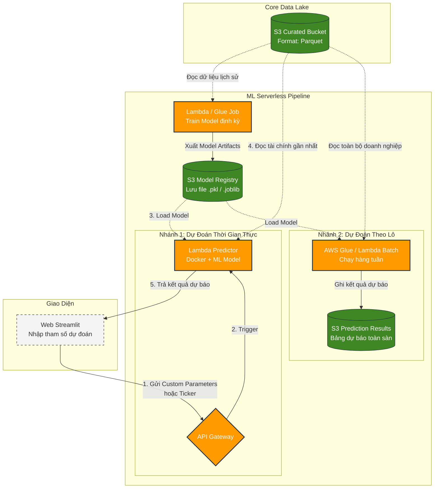

# Đề Xuất Kiến Trúc: Tích Hợp Phân Tích Dự Báo (Predictive Analytics)
**Dự án: AWS Serverless Financial Data Lake (Mở rộng Phase 2)**

Tài liệu này đề xuất phương án và kiến trúc để tích hợp mô hình Học máy (Machine Learning/Predictive Analytics) nhằm **dự báo xu hướng, nguy cơ thua lỗ, hoặc phá sản** của các doanh nghiệp dựa trên nguồn dữ liệu tài chính đã thu thập vào Data Lake.

---

## I. Gợi Ý Các Dịch Vụ AWS Serverless Đảm Nhận Xử Lý

Để chạy mô hình dự báo theo tư duy **Serverless** (không tốn chi phí duy trì khi không sử dụng), AWS cung cấp 3 lựa chọn tối ưu sau đây:

### Lựa chọn 1: AWS Lambda (Docker Containerized) - *Khuyên dùng cho Đồ án/Team Nhỏ*
*   **Cách hoạt động:** Đóng gói model đã train sẵn (dưới dạng file `.pkl` hoặc `.joblib`) cùng các thư viện phân tích (`scikit-learn`, `pandas`, `xgboost`) vào Docker Image, deploy lên AWS Lambda. Khi người dùng chọn doanh nghiệp trên Web UI, Streamlit gửi API request -> API Gateway -> Kích hoạt Lambda tải model và chạy dự đoán thời gian thực.
*   **Ưu điểm:** 
    *   **Hoàn toàn miễn phí** trong hạn mức AWS Free Tier (1 triệu request/tháng).
    *   Tốc độ phản hồi cực nhanh (Low latency), không tốn chi phí rảnh (Zero Idle Cost).
    *   Tận dụng cấu trúc Docker ECR đã có sẵn ở các tuần trước.
*   **Nhược điểm:** Phù hợp với các mô hình kích thước vừa và nhỏ (như Random Forest, XGBoost, Logistic Regression). Không thích hợp cho Deep Learning quá nặng (như LLMs, neural networks lớn).

### Lựa chọn 2: Amazon SageMaker Serverless Inference - *Chuẩn chỉnh Machine Learning Production*
*   **Cách hoạt động:** Bạn train model trên máy local hoặc SageMaker Studio, sau đó deploy mô hình lên một **SageMaker Serverless Endpoint**. Khi cần dự báo, Lambda Reader sẽ gọi endpoint này thông qua thư viện `boto3`.
*   **Ưu điểm:**
    *   Được thiết kế chuyên biệt cho Machine Learning (quản lý phiên bản model, tự động scale RAM lên tới 6GB).
    *   Chỉ trả tiền cho thời gian chạy suy luận thực tế (tính bằng mili-giây), tự động scale về 0 khi không có người truy cập.
*   **Nhược điểm:** Vẫn có hiện tượng trễ khởi động lạnh (Cold Start) khi có request đầu tiên sau một thời gian không dùng. Cấu hình phức tạp hơn Lambda độc lập.

### Lựa chọn 3: Amazon Athena ML (Tích hợp Athena & SageMaker) - *Wow Factor mạnh nhất*
*   **Cách hoạt động:** Athena cho phép gọi trực tiếp mô hình SageMaker bằng các câu lệnh SQL thuần túy. 
    *   Ví dụ: `SELECT ticker, sagemaker_predict('bankruptcy-model', revenue, debt) FROM curated_financial_data;`
*   **Ưu điểm:** Cực kỳ ấn tượng khi trình bày. Không cần viết code API Backend để gọi model, truy vấn SQL chạy trực tiếp trên Data Lake và trả ngay kết quả dự báo.
*   **Nhược điểm:** Yêu cầu phải duy trì SageMaker Endpoint (có thể phát sinh chi phí nếu không quản lý kỹ).

---

## II. Các Ý Tưởng Dự Báo Tài Chính Thực Tế & Khả Thi

Với dữ liệu tài chính doanh nghiệp từ `vnstock`, bạn có thể triển khai các mô hình thực tế sau:

### 1. Dự Báo Nguy Cơ Phá Sản (Bankruptcy Risk) bằng Chỉ Số Altman Z-Score
*   **Phương pháp:** Đây là mô hình định lượng tài chính kinh đoán thế giới dành cho các công ty niêm yết (Altman Z-Score cho các công ty sản xuất/phi sản xuất).
*   **Công thức Z-Score gốc:** $Z = 1.2X_1 + 1.4X_2 + 3.3X_3 + 0.6X_4 + 0.999X_5$
    *   $X_1$: Vốn lưu động / Tổng tài sản (Working Capital / Total Assets) - Đo lường tính thanh khoản.
    *   $X_2$: Lợi nhuận giữ lại / Tổng tài sản (Retained Earnings / Total Assets) - Đo lường mức độ tích lũy lợi nhuận.
    *   $X_3$: Lợi nhuận trước thuế và lãi vay (EBIT) / Tổng tài sản - Đo lường hiệu quả hoạt động.
    *   $X_4$: Giá trị thị trường của vốn chủ sở hữu / Tổng nợ phải trả - Đo lường đòn bẩy tài chính.
    *   $X_5$: Doanh thu / Tổng tài sản - Đo lường hiệu suất sử dụng tài sản.
*   **Ngưỡng đánh giá:**
    *   **Z > 2.99:** Vùng An toàn (Safe Zone) - Nguy cơ phá sản cực kỳ thấp.
    *   **1.81 <= Z <= 2.99:** Vùng Cảnh báo (Grey Zone) - Có rủi ro nhưng chưa quá nghiêm trọng.
    *   **Z < 1.81:** Vùng Nguy hiểm (Distress Zone) - Nguy cơ phá sản cao trong vòng 2 năm tới.
*   *Ý tưởng đồ án:* Dùng Python tính toán động chỉ số này trong Spark/Lambda ETL và lưu vào S3 Curated, hoặc dùng Lambda Predictor tính toán real-time khi người dùng nhập thông số tùy chỉnh trên UI.

### 2. Dự Báo Doanh Nghiệp Thua Lỗ (Loss Prediction / Credit Scoring) bằng Machine Learning
*   **Bài toán:** Dự báo xác suất công ty sẽ bị lỗ ròng (Lợi nhuận sau thuế < 0) trong quý tiếp theo.
*   **Thuật toán:** Phân loại nhị phân (Binary Classification) sử dụng **XGBoost** hoặc **Random Forest**.
*   **Input Features:** Các chỉ số tài chính cơ bản thu thập từ Báo cáo tài chính quý trước:
    *   Tỷ lệ nợ trên tài sản (Debt/Assets).
    *   Tỷ suất lợi nhuận gộp (Gross Margin).
    *   Tốc độ tăng trưởng doanh thu (Revenue Growth).
    *   Chỉ số thanh toán nhanh (Quick Ratio).
*   **Output:** Xác suất thua lỗ (0% - 100%).

---

## III. Sơ Đồ Kiến Trúc Hệ Thống Mở Rộng (Mermaid)

Kiến trúc dưới đây tích hợp luồng dự đoán thời gian thực (Real-time Inference) và dự đoán theo lô (Batch Inference) vào Data Lake hiện tại:



---

## IV. Hướng Dẫn Từng Bước Triển Khai (Dùng Lambda Docker)

Để dễ đạt điểm tối đa mà không mất chi phí, hãy chọn phương án **AWS Lambda (Docker)** để chạy dự báo thời gian thực với các bước sau:

### Bước 1: Huấn luyện mô hình (Local)
1. Sử dụng Notebook trên máy local để kéo dữ liệu tài chính từ S3 Raw/Curated về.
2. Xây dựng mô hình phân loại (ví dụ: Random Forest) để dự đoán nhãn `is_loss` (1 nếu quý sau lỗ, 0 nếu lãi).
3. Export mô hình ra file:
   ```python
   import joblib
   joblib.dump(model, 'model_bankruptcy.joblib')
   ```

### Bước 2: Tạo Docker Image cho Lambda Predictor
Viết file `src/lambda_predictor/main.py` để load model và tính toán:

```python
import json
import joblib
import numpy as np

# Load model khi container khởi động (chỉ load 1 lần để tối ưu tốc độ)
model = joblib.load('model_bankruptcy.joblib')

def handler(event, context):
    try:
        # 1. Nhận các tham số đầu vào gửi từ Web Streamlit qua API Gateway
        body = json.loads(event.get('body', '{}'))
        
        # Ví dụ các thông số tài chính đầu vào:
        # x1: Working Capital/Assets, x2: Retained Earnings/Assets, 
        # x3: EBIT/Assets, x4: Equity/Liabilities, x5: Sales/Assets
        x1 = float(body.get('working_capital_ratio', 0))
        x2 = float(body.get('retained_earnings_ratio', 0))
        x3 = float(body.get('ebit_ratio', 0))
        x4 = float(body.get('equity_debt_ratio', 0))
        x5 = float(body.get('sales_ratio', 0))
        
        # 2. Tính toán Altman Z-Score nhanh bằng công thức tài chính
        z_score = 1.2*x1 + 1.4*x2 + 3.3*x3 + 0.6*x4 + 0.999*x5
        
        if z_score > 2.99:
            z_status = "Safe (An toàn)"
            bankruptcy_risk = "Thấp"
        elif z_score >= 1.81:
            z_status = "Grey Zone (Cảnh báo)"
            bankruptcy_risk = "Trung bình"
        else:
            z_status = "Distress (Nguy hiểm)"
            bankruptcy_risk = "Cao"
            
        # 3. Đưa vào mô hình Machine Learning dự đoán xác suất thua lỗ quý tới
        features = np.array([[x1, x2, x3, x4, x5]])
        loss_probability = model.predict_proba(features)[0][1] * 100 # Tỷ lệ %
        
        # 4. Trả kết quả về cho Streamlit
        response_body = {
            "altman_z_score": round(z_score, 2),
            "altman_status": z_status,
            "bankruptcy_risk": bankruptcy_risk,
            "loss_probability_percent": round(loss_probability, 2)
        }
        
        return {
            "statusCode": 200,
            "headers": {
                "Content-Type": "application/json",
                "Access-Control-Allow-Origin": "*" # Bật CORS cho Streamlit gọi trực tiếp
            },
            "body": json.dumps(response_body)
        }
    except Exception as e:
        return {
            "statusCode": 500,
            "body": json.dumps({"error": str(e)})
        }
```

### Bước 3: Đóng gói và Deploy bằng Terraform
1. Viết `Dockerfile` tương tự tuần 1 nhưng cài thêm `scikit-learn` và sao chép file `model_bankruptcy.joblib` vào image.
2. Cấu hình Terraform (`terraform/lambda.tf`) để định nghĩa Lambda này:
   ```hcl
   resource "aws_lambda_function" "predictor" {
     function_name = "financial-predictor"
     role          = aws_iam_role.lambda_role.arn
     package_type  = "Image"
     image_uri     = "${aws_ecr_repository.predictor.repository_url}:latest"
     timeout       = 15
     memory_size   = 512
   }
   ```
3. Tạo Route `/predict` trên API Gateway trỏ về Lambda này.

### Bước 4: Tạo Giao Diện Web trên Streamlit
Trên giao diện Streamlit, thiết kế một form cho phép người dùng:
1. Chọn mã cổ phiếu (Hệ thống tự động tra cứu chỉ số tài chính gần nhất từ Athena rồi điền vào form).
2. Hoặc người dùng tự kéo các thanh trượt (Sliders) để giả định kịch bản xấu/tốt của doanh nghiệp (ví dụ: "Nếu nợ tăng gấp đôi thì nguy cơ thế nào?").
3. Bấm nút **"Chạy dự báo"** -> Gửi request lên `/predict` và hiển thị kết quả bằng biểu đồ cảnh báo màu sắc (Đỏ: Nguy hiểm, Vàng: Cảnh báo, Xanh: An toàn).
