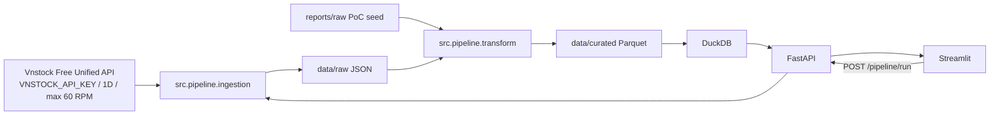
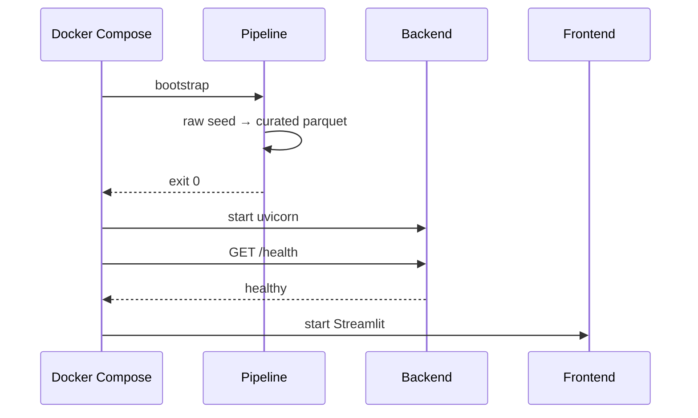

# Local PoC Architecture

## Component map

## Quyết định chính

1. **Một schema canonical:** Raw, Curated, API và FE đều dùng tên trường chuẩn từ data contract.
2. **Tách bootstrap khỏi live ingestion:** Compose luôn khởi động từ evidence cục bộ; source thật chỉ được gọi chủ động.
3. **DuckDB query-on-read:** Không cần database server cho PoC; API query trực tiếp Parquet.
4. **Partition theo ticker:** Giảm phạm vi file phải đọc và giúp thay thế dữ liệu của từng ticker độc lập.
5. **Một cấu hình chung:** `src/settings.py` đọc environment/`.env`; frontend chỉ nhận `API_BASE_URL`.
6. **Secrets không đi qua FE:** `VNSTOCK_API_KEY` chỉ tồn tại trong backend/pipeline environment.
7. **Free-tier guard:** Source adapter fail-fast nếu thiếu key, interval khác `1D` hoặc rate vượt 60 RPM.

## Startup sequence

## Scale path

Các interface quan trọng đã tách riêng: source adapter, raw contract, transform và consumption service. Khi nâng lên AWS có thể thay local filesystem bằng S3, CLI/service bằng EventBridge/SQS/Lambda/ECS và DuckDB local bằng Athena/Glue mà không thay đổi schema giao tiếp với frontend.
